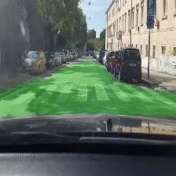
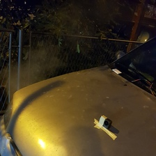

# Self driving car

The code:
- finetunes VIT to segment the image and get the road
- uses gopro as a camera
- uses CNC stepper motors and controller to control the steering wheel of the car

The power to drive the stepper motors is received through modified car phone charger

A photo of a car with gopro and videos of driving (by a human)

## Structure
- machine_learning -> directory contains the code to finetune VIT to detect the road
- assets -> directory contains arrows
- drive.py -> the main program to run in the actual car
- drive_in_simulator.py -> the progam to use udacity self driving simulator to test strategies
- actuation.py -> code to control stepper motors which control the steering wheel
- start_gopro.py -> simple script to start receiving gopro frames over Wifi

works in simulation but needs stronger motors for real world.
